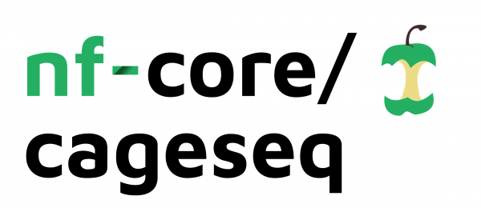

# 

[](https://github.com/nf-core/cageseq/actions)
[](https://github.com/nf-core/cageseq/actions)
[](https://www.nextflow.io/)

[](https://bioconda.github.io/)
[](https://hub.docker.com/r/nfcore/cageseq)
[](https://nfcore.slack.com/channels/cageseq)

## Introduction

**nf-core/cageseq** is a bioinformatics analysis pipeline used for CAGE-seq sequencing data.

The pipeline takes raw demultiplexed fastq-files as inputs and includes steps for linker and artefact trimming
([cutadapt](https://cutadapt.readthedocs.io/en/stable/guide.html)), rRNA removal ([SortMeRNA](https://github.com/biocore/sortmerna), alignment to a reference genome ([STAR](https://github.com/alexdobin/STAR) or [bowtie1](http://bowtie-bio.sourceforge.net/index.shtml)) and CAGE tag counting
and clustering ([paraclu](http://cbrc3.cbrc.jp/~martin/paraclu/)).
Additionally, several quality control steps
([FastQC](https://www.bioinformatics.babraham.ac.uk/projects/fastqc/),
[RSeQC](http://rseqc.sourceforge.net/),
[MultiQC](https://multiqc.info/))
are included to allow for easy verification of the results after a run.

The pipeline is built using [Nextflow](https://www.nextflow.io), a workflow tool to run tasks across multiple compute infrastructures in a very portable manner. It comes with docker containers making installation trivial and results highly reproducible.

## Quick Start

1. Install [`nextflow`](https://nf-co.re/usage/installation)

2. Install either [`Docker`](https://docs.docker.com/engine/installation/) or [`Singularity`](https://www.sylabs.io/guides/3.0/user-guide/) for full pipeline reproducibility _(please only use [`Conda`](https://conda.io/miniconda.html) as a last resort; see [docs](https://nf-co.re/usage/configuration#basic-configuration-profiles))_

3. Download the pipeline and test it on a minimal dataset with a single command:

    ```bash
    nextflow run nf-core/cageseq -profile test,<docker/singularity/conda/institute>
    ```

    > Please check [nf-core/configs](https://github.com/nf-core/configs#documentation) to see if a custom config file to run nf-core pipelines already exists for your Institute. If so, you can simply use `-profile <institute>` in your command. This will enable either `docker` or `singularity` and set the appropriate execution settings for your local compute environment.

4. Start running your own analysis!

```bash
nextflow run nf-core/cageseq -profile <docker/singularity/conda/institute> --input '*_R1.fastq.gz' --aligner <'star'/'bowtie1'> --genome GRCh38
```

See [usage docs](docs/usage.md) for all of the available options when running the pipeline.

## Documentation

The nf-core/cageseq pipeline comes with documentation about the pipeline which you can read at [https://nf-co.re/cageseq/usage](https://nf-co.re/cageseq/usage) and [https://nf-co.re/cageseq/output](https://nf-co.re/cageseq/output) or find in the [`docs/` directory](docs).

## Credits

nf-core/cageseq was originally written by Kevin Menden ([@KevinMenden](https://github.com/KevinMenden)) and Tristan Kast ([@TrisKast](https://github.com/TrisKast)) and updated by Matthias Hörtenhuber ([@mashehu](https://github.com/mashehu)).

## Contributions and Support

If you would like to contribute to this pipeline, please see the [contributing guidelines](.github/CONTRIBUTING.md).

For further information or help, don't hesitate to get in touch on the [Slack `#cageseq` channel](https://nfcore.slack.com/channels/cageseq) (you can join with [this invite](https://nf-co.re/join/slack)).

## Citation

<!-- TODO nf-core: Add citation for pipeline after first release. Uncomment lines below and update Zenodo doi. -->
<!-- If you use  nf-core/cageseq for your analysis, please cite it using the following doi: [10.5281/zenodo.XXXXXX](https://doi.org/10.5281/zenodo.XXXXXX) -->

You can cite the `nf-core` publication as follows:

> **The nf-core framework for community-curated bioinformatics pipelines.**
>
> Philip Ewels, Alexander Peltzer, Sven Fillinger, Harshil Patel, Johannes Alneberg, Andreas Wilm, Maxime Ulysse Garcia, Paolo Di Tommaso & Sven Nahnsen.
>
> _Nat Biotechnol._ 2020 Feb 13. doi: [10.1038/s41587-020-0439-x](https://dx.doi.org/10.1038/s41587-020-0439-x).
> ReadCube: [Full Access Link](https://rdcu.be/b1GjZ)
